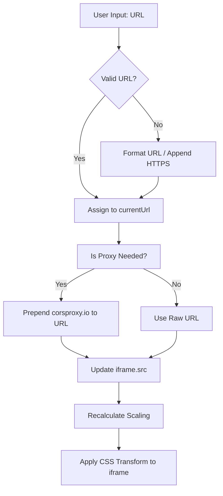

# Architecture & Data Flow

*Test. Preview. Perfect.*

## 1. System Architecture
ResponsiveLab is built as a **Single Page Application (SPA)** utilizing a purely client-side architecture. It operates entirely within the user's browser, eliminating the need for a backend server or database. 

## 2. Core Components
- **User Interface (UI)**: Built with semantic HTML5 and styled with vanilla CSS. Uses CSS variables for theming.
- **State Management**: Handled via Vanilla JavaScript. Variables track the `currentUrl`, `currentWidth`, and `currentHeight`.
- **Persistent Storage**: Utilizes the browser's native `localStorage` API to save and retrieve "Custom Device Sizes" created by the user.
- **Rendering Engine**: Uses an `<iframe>` element dynamically styled with CSS `transform: scale()` to fit large resolutions into the user's physical viewport.

## 3. Data Flow Diagram

## 4. Scaling Logic
When a device resolution (e.g., 1920x1080) is larger than the available screen area in the UI:
1. The script calculates the available width and height of the `.preview-area`.
2. It determines the scale ratio: `Math.min(availableWidth / targetWidth, availableHeight / targetHeight)`.
3. It applies this scale using `transform: scale(ratio)` to the iframe, ensuring the entire emulated device is visible without scrolling the main page.

## 5. Security & CORS Bypass
Because modern web security (`X-Frame-Options`, `Content-Security-Policy`) prevents external domains from being embedded inside iframes, the tool routes traffic through a public CORS proxy (`corsproxy.io`). This proxy fetches the target HTML on the backend and serves it back to the client with the restrictive headers stripped away.
